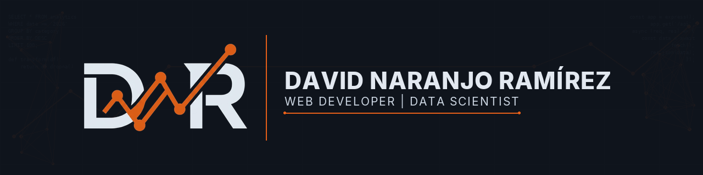

  

  
  
  

<h3 align="center">I build data pipelines and web applications — from raw data to deployed product.</h3>

  Data Science &amp; Web Development student turning academic projects into production-grade, portfolio-ready work. 
  Currently focused on <b>dimensional data warehousing</b>, <b>SQL analytics</b> and <b>full-stack web development</b>.

---

### &#128293;&nbsp; Currently building

- **[Olist E-commerce Data Warehouse](https://github.com/dnarram/olist-ecommerce-datawarehouse)** — a full dimensional model (star schema) over the Brazilian Olist dataset, built with PostgreSQL &amp; DBeaver. ETL, fact/dimension design and analytical queries end to end.
- **MSc Data Science** @ Evolve Academy &nbsp;·&nbsp; **DAW (Web App Development)** @ Ilerna — shipping graded projects that double as portfolio pieces.

---

### &#128736;&nbsp; Tech stack

<table>
  <tr>
    <td valign="top" width="50%">

**Data &amp; Analytics**

  </td>
    <td valign="top" width="50%">

**Web Development**

  </td>
  </tr>
</table>

<b>Environment:</b> VS Code · DBeaver · Git · Linux

---

### &#128202;&nbsp; GitHub activity

  
  

---

  Open to <b>Junior Data Engineer</b>, <b>Data Analyst</b> and <b>Web Developer</b> roles &amp; internships.

